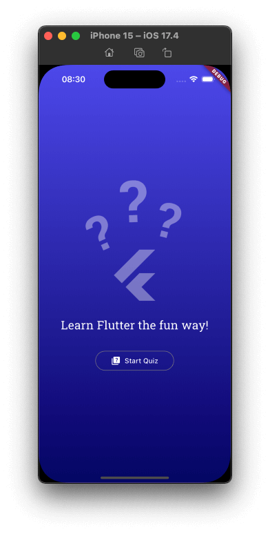
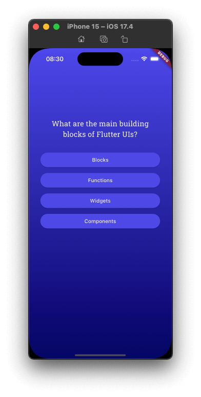
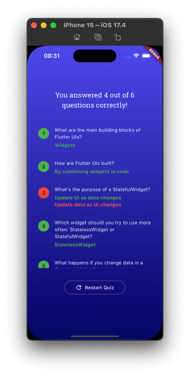

# Quiz

| Start | Question | Result |
| -------- | -------- | -------- |
|  |  |  |

## About the project

The Quiz app is a cross-platform application built using Flutter. The main feature of the application is a quiz that tests your knowledge about Flutter.

It presents a series of questions, each with multiple choice answers. The questions cover various aspects of Flutter, such as the main building blocks of Flutter UIs, how Flutter UIs are built, the purpose of a StatefulWidget, and more.

I'm following a Udemy's course, but it has some tweeks on the design and functionalities.

## Features

- Test your knowledge with a series of questions about Flutter.
- Multiple-choice answers for each question.
- Learn more about Flutter's main building blocks and UI components.
- Engaging and educational quiz experience.
